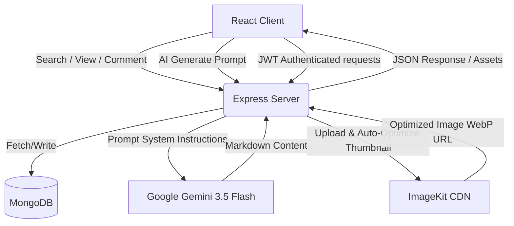

# Quickblog – AI Powered MERN Blog Platform

Quickblog is a modern, high-performance, full-stack blogging platform built on the **MERN stack** (MongoDB, Express, React, Node.js). It integrates the Google Gemini API to enable instant AI-assisted technical blog writing, and uses ImageKit for fast, optimized image uploads and webp transformation.

---

## 📸 Application Screenshots

### 🌐 Reader Landing Page


### 🛠️ Admin Dashboard & Panel


---

## 🏗️ Architecture & Flow

Quickblog uses a decoupled client-server architecture with stateful token authentication. The flowchart below illustrates how components interact:



### Key Architectural highlights:

1. **AI Generation Engine**: Express server wraps the `@google/genai` SDK. When an admin requests AI content, a tailored prompt constraints Gemini to return high-quality Markdown, which is parsed to HTML on the frontend and loaded into the **Quill Rich-Text Editor**.
2. **CDN Optimization**: Images are uploaded to **ImageKit** as raw buffers. ImageKit dynamically transforms them to `webp`, resizes them to `1280px` max-width, and applies auto-quality parameters to ensure lightning-fast page loading.
3. **Comment Moderation Flow**: Comments submitted by readers default to `isApproved = false`. The admin reviews them on the Admin Panel before approving them for display under the blog post.

---

## 🛠️ Technology Stack

### Frontend (Client)

- **Vite + React 19** – Fast SPA build tool and rendering library.
- **Tailwind CSS v4** – Modern utility-first CSS framework for styles.
- **React Router Dom v7** – Dynamic routing with client-side guards.
- **Framer Motion v12** – Fluid micro-animations (e.g., interactive navigation underlines).
- **Quill Editor** – Rich-text input for authors.
- **Marked** – High-performance Markdown parser.
- **Axios** – Promise-based HTTP client for API requests.
- **React Hot Toast** – Graceful notification popups.

### Backend (Server)

- **Node.js & Express** – Lightweight HTTP server environment.
- **Mongoose** – Elegant MongoDB object modeling.
- **Google GenAI SDK** – Integration with `gemini-3.5-flash` for content synthesis.
- **ImageKit SDK** – Media optimization and CDN delivery.
- **Multer** – Middleware for handling file uploads.
- **JSONWebToken (JWT)** – Verification and stateless session management.

---

## 📂 Project Structure

```
ai-powered-blog-platform/
├── client/                  # Frontend SPA (React + Vite)
│   ├── public/              # Static assets
│   ├── src/
│   │   ├── assets/          # Shared images, icons, and constants
│   │   ├── components/      # UI Components (BlogCard, Header, Newsletter)
│   │   │   └── admin/       # Admin-specific components (Sidebar, Login)
│   │   ├── context/         # AppContext for global state management
│   │   ├── pages/           # Public pages (Home, Blog view)
│   │   │   └── admin/       # Admin Dashboard pages (AddBlog, ListBlog, Comment)
│   │   ├── App.jsx          # Route definitions
│   │   ├── index.css        # Tailwind base and custom rules
│   │   └── main.jsx         # App bootstrapping
│   └── vercel.json          # Frontend deployment configuration
│
└── server/                  # Backend REST API (Node.js + Express)
    ├── configs/             # Database connection, Gemini, & ImageKit clients
    ├── controllers/         # Business logic (adminController, blogController)
    ├── middleware/          # Security (JWT auth) & File Upload (Multer)
    ├── models/              # MongoDB Mongoose Schemas (Blog, Comment)
    ├── routes/              # Express API Routes (adminRoutes, blogRoutes)
    ├── server.js            # Express application wrapper
    └── vercel.json          # Server deployment configuration
```

---

## 💾 Database Schemas

### 📝 Blog Model (`server/models/Blog.js`)

```javascript
{
  title: { type: String, required: true },
  subTitle: { type: String },
  description: { type: String, required: true }, // Rich-text HTML
  category: { type: String, required: true },
  image: { type: String, required: true },       // ImageKit optimized URL
  isPublished: { type: Boolean, required: true }
}
```

### 💬 Comment Model (`server/models/Comment.js`)

```javascript
{
  blog: { type: Schema.Types.ObjectId, ref: "blog", required: true },
  name: { type: String, required: true },
  content: { type: String, required: true },
  isApproved: { type: Boolean, default: false } // Admin approval flag
}
```

---

## ⚙️ Installation & Setup

### 1️⃣ Clone the Repository

```bash
git clone https://github.com/newaz10/ai-powered-blog-app.git
cd ai-powered-blog-app
```

### 2️⃣ Configure Environment Variables

Create `.env` files in both the `client/` and `server/` directories.

#### 🔧 Backend `.env` (`server/.env`)

```ini
PORT=3000
MONGODB_URI=mongodb+srv://<username>:<password>@cluster.mongodb.net
JWT_SECRET=your_jwt_signing_key

# ImageKit Configuration
IMAGEKIT_PUBLIC_KEY=your_imagekit_public_key
IMAGEKIT_PRIVATE_KEY=your_imagekit_private_key
IMAGEKIT_URL_ENDPOINT=https://ik.imagekit.io/your_endpoint_id

# Google Gemini API
GEMINI_API_KEY=your_google_gemini_api_key

# Admin Credentials
ADMIN_EMAIL=admin@quickblog.com
ADMIN_PASSWORD=secure_admin_password
```

#### 🔧 Frontend `.env` (`client/.env`)

```ini
VITE_BASE_URL=http://localhost:3000
```

### 3️⃣ Setup the Backend Server

```bash
cd server
npm install
npm start
```

### 4️⃣ Setup the Frontend Client

Open a new terminal tab:

```bash
cd client
npm install
npm run dev
```

---

## 🌐 API Reference

### Blog Controller (`/api/blog`)

- `POST /add` – Add new blog post (Uploads thumbnail, requires JWT)
- `GET /all` – Get all published blogs (Public)
- `GET /:blogId` – Get single blog by ID (Public)
- `POST /delete` – Delete blog (Requires JWT)
- `POST /toggle-publish` – Publish/unpublish blog (Requires JWT)
- `POST /add-comment` – Add comment for review (Public)
- `POST /comments` – Get approved comments for a blog post (Public)
- `POST /generate` – AI content generator using Gemini (Requires JWT)

### Admin Controller (`/api/admin`)

- `POST /login` – Admin login authentication
- `GET /blogs` – Get all blogs for management (Requires JWT)
- `GET /comments` – Get all comments for review (Requires JWT)
- `POST /approve-comment` – Approve comment by ID (Requires JWT)
- `POST /delete-comment` – Delete comment by ID (Requires JWT)
- `GET /dashboard` – Fetch counts & dashboard data (Requires JWT)

---

## 🤝 Contributing

Contributions are always welcome!

1. Fork the repository
2. Create a feature branch: `git checkout -b feature/YourFeature`
3. Commit your changes: `git commit -m "feat: Add some feature"`
4. Push to branch: `git push origin feature/YourFeature`
5. Open a Pull Request
